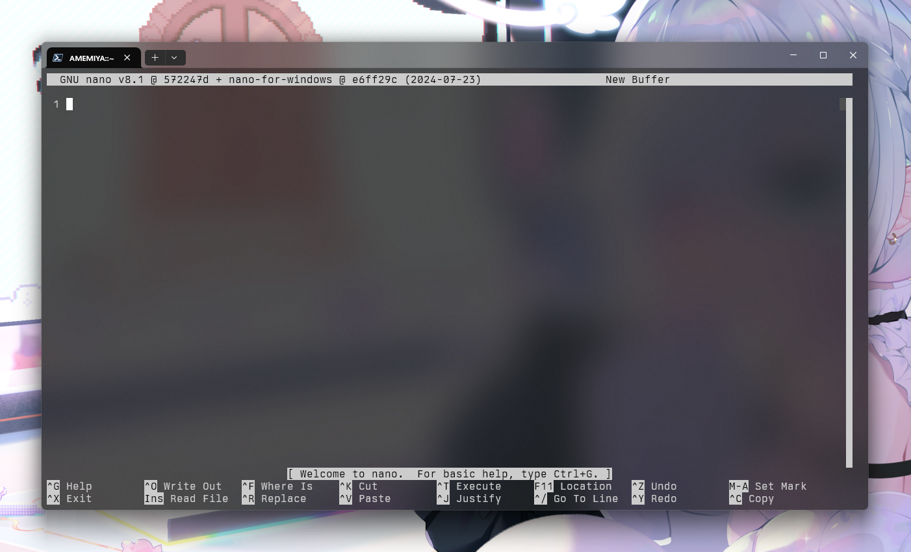
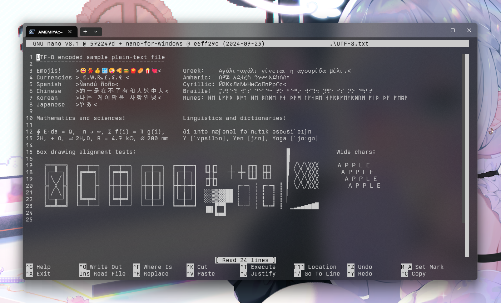

<div align="center">

# nano-for-windows

</div>

A proper Windows port of the [nano](https://www.nano-editor.org/) editor for
AMD64 (and soon Windows on ARM/AArch64). Runs in any UTF-8 supporting terminal,
like the new Windows Terminal. Does NOT work with the standard conhost.exe.

This project merely provides patches for the nano source to work on Windows.

<div align="center">
</div>

# Features ported to Windows

Pretty much everything is supported except for Linux-specific functions,
including:

* Interface customization: colors, key shortcuts, line numbers, infobar, scroll
bar, etc...
* Syntax coloring for 47 different types of documents. It can be upgraded thanks
to community support, for instance [here](https://github.com/scopatz/nanorc) or
[here](https://github.com/mitchell486/nanorc) you can find additional syntax
files for many other document types.
* Full support for UTF-8 encoded files.
* Supplemental Unicode character support, including all the languages and emojis
😜in the CLI interface.
* Multi-document editor.
* Integrated file browser.
* Mouse support for scroll and cursor location.
* Normal and regular expression (regex) search and replace.
* Auto-indent, syntax highlight and fast line comment for many programming
languages.
* Line wrap, search, cut, copy & paste, and all the basic functions of any
full-fledged editor.
* Data input through stdin support, from a pipe or the keyboard.
* Transparent backgrounds in Windows Terminal, and other supported environments.
* ~~Beta native support for Windows on ARM (WoA)~~

<div align="center">

</div>

<br/>

# Installation via direct download

Visit the [releases](https://github.com/helpimnotdrowning/nano-for-windows/releases)
page, and download the latest release file ending in `.zip` for your
architecture (~~i386, ~~ x86_64  ~~, or Windows on Arm~~). Then unzip
the file to a directory in your `%PATH%`.

# Usage

Nano provides documentation for nano itself: **[documentation](https://www.nano-editor.org/docs.php)**
Quick reference are available in the F1 help menu in nano.

Your personal nanorc file is located in `~/.nanorc` and the global nanorc is in
`$env:ProgramData/nano-for-windows/nanorc` (where `$env:ProgramData is *usually*
`C:\ProgramData`)

You can edit these files through nano itself:
itself:
```pwsh
nano ~/.nanorc
```

```pwsh
nano $env:ProgramData/nano-for-windows/nanorc
```

# Notes

* When using Windows Terminal and the screen is resized within nano, after
returning to the shell there could be some corruption due to the new size. To
fix the issue without losing the terminal history just resize the terminal
window to zero lines and return to the desired size.

* Feel free to open any issue you find, or use the [Discussions]
(https://github.com/helpimnotdrowning/nano-for-windows/discussions) section for
any other issue, suggestion, question, etc...
